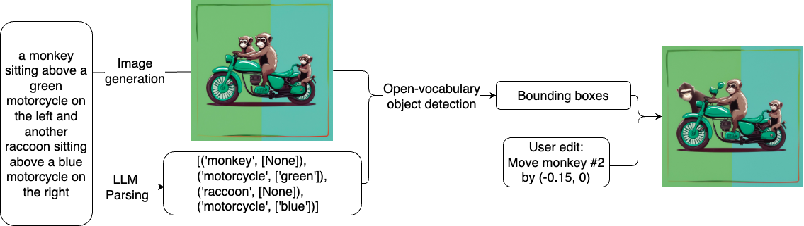
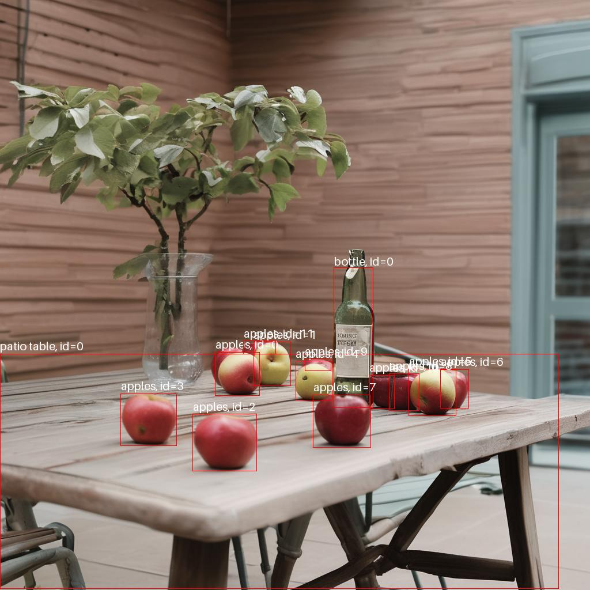
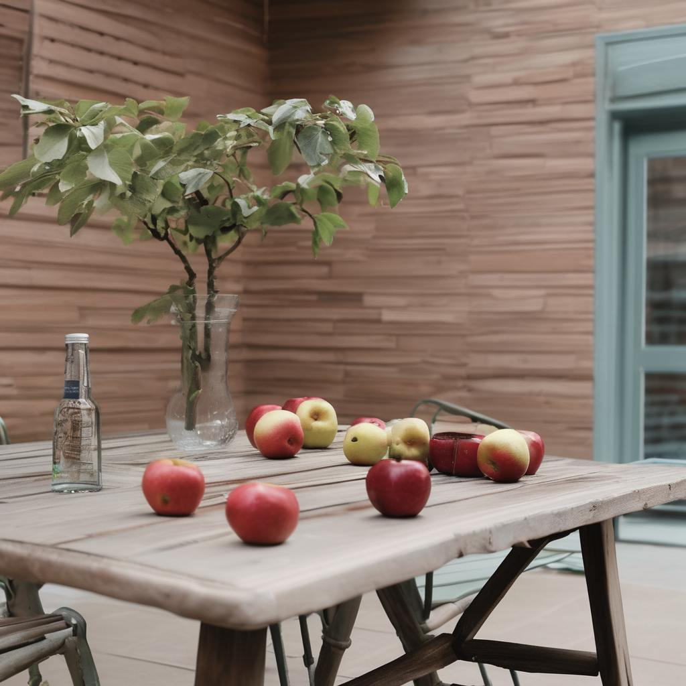

# LLM-guided Instance-level Image Manipulation with Diffusion U-Net Cross-Attention Maps
Official implementation of the paper [LLM-guided Instance-level Image Manipulation with Diffusion U-Net Cross-Attention Maps](https://openreview.net/forum?id=kkaWj2UwN9) (accepted at BMVC 2024).

> **LLM-guided Instance-level Image Manipulation with Diffusion U-Net Cross-Attention Maps**<br>
> Andrey Palaev<sup>1</sup>, Adil Khan<sup>1</sup>, Syed M. Ahsan Kazmi<sup>1</sup><br>
> <sup>1</sup>[AIDecisions](https://aidecisions.ai)<br>
>
> <p align="justify"><b>Abstract:</b> <i>The advancement of text-to-image synthesis has introduced powerful generative models capable of creating realistic images from textual prompts. However, precise control over image attributes remains challenging, especially at the instance level. While existing methods offer some control through fine-tuning or auxiliary information, they often face limitations in flexibility and accuracy. To address these challenges, we propose a pipeline leveraging Large Language Models (LLMs), open-vocabulary detectors and cross-attention maps and intermediate activations of diffusion U-Net for instance-level image manipulation. Our method detects objects mentioned in the prompt and present in the generated image, enabling precise manipulation without extensive training or input masks. By incorporating cross-attention maps, our approach ensures coherence in manipulated images while controlling object positions. Our method enables precise manipulations at the instance level without fine-tuning or auxiliary information such as masks or bounding boxes.</i></p>

## Installation
1. Install poetry using the official instructions: https://python-poetry.org/docs/
2. Create virtual environment using venv or conda (was tested on conda)
3. Install the requirements with ```poetry install```

## Methodology


Our pipeline is the following:
1. User gives the prompt
2. Diffusion model (Stable Diffusion XL) generates an image
3. LLM (Gemma-7B) parses the objects from the prompt
4. An open-vocabulary object detector (OWLv2) detects these objects on the image
5. User selects the object (among the detected) to be repositioned and specifies how it should be repositioned
6. The image is edited with the use of guidance based on intermediate features and cross-attention maps in the diffusion model

Note that this pipeline uses only pretrained models and does not require any training or fine-tuning.

## Results

a) Move bottle by (−0.5, 0)

  